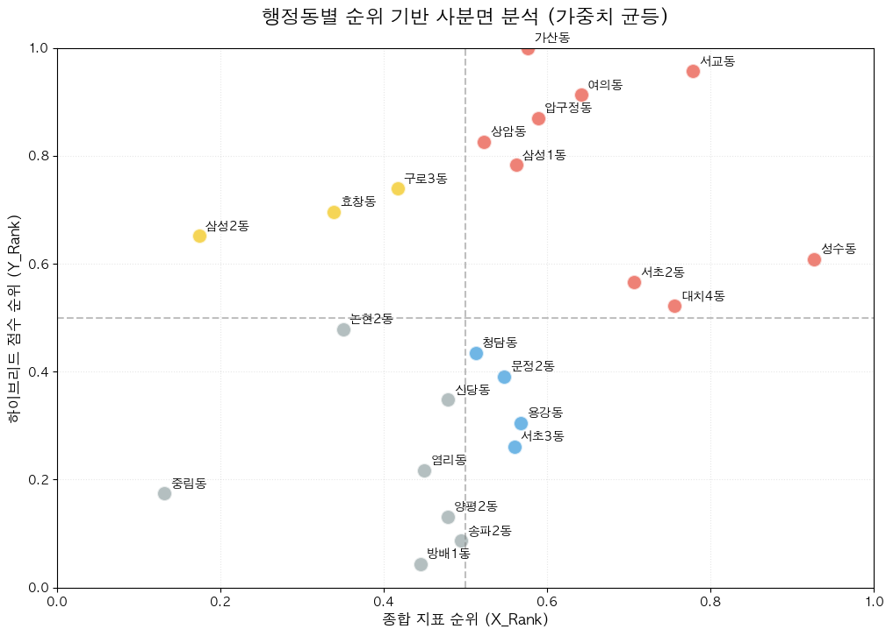

# 📊 사분면 분석 상세

**가중합산 스코어링(Weighted Composite Scoring)** 기법을 활용하여 행정동을 4개 그룹으로 분류합니다.

---

## 분석 목적

- 단순히 "지금 핫한 곳"이 아닌 **"앞으로 뜰 가능성이 있는 곳"** 탐색
- **X축 (X-Index)**: 검색량, 블로그 등 온라인 관심도 기반 성장 잠재력
- **Y축 (하이브리드 점수)**: 현재 상권 경쟁력

---

## 사용 지표

| 지표          | 설명                        | 출처            | 가중치 |
| ------------- | --------------------------- | --------------- | ------ |
| **CAGR**      | 키워드 검색량 연평균 성장률 | 판다랭크        | 34%    |
| **avg_naver** | 네이버 검색량 평균          | 네이버 데이터랩 | 33%    |
| **blog_post** | 블로그 총 게시글 수         | 판다랭크        | 33%    |

### 가중치 설정 근거

- 세 지표를 거의 **균등하게 배분**
- 특정 지표에 치우치지 않는 **균형 잡힌 종합 평가**

---

## CAGR 계산

**CAGR (Compound Annual Growth Rate)**: 키워드 검색량 연평균 성장률

```
CAGR = (2025년 검색량 / 2023년 검색량)^(1/2) - 1
```

### 예시

| 행정동  | 키워드              | 2023년    | 2025년    | CAGR       | 해석      |
| ------- | ------------------- | --------- | --------- | ---------- | --------- |
| 대치4동 | 선릉역 맛집         | 508,302   | 919,531   | **+34.5%** | 급성장    |
| 가산동  | 가산디지털단지 맛집 | 35,537    | 37,758    | +3.1%      | 소폭 성장 |
| 성수동  | 성수 맛집           | 1,903,467 | 1,923,897 | +0.5%      | 유지      |
| 구로3동 | 구로디지털단지 맛집 | 441,361   | 255,619   | **-23.9%** | 하락      |

---

## 순위(Rank) 변환

### 왜 필요한가?

각 지표의 단위와 스케일이 다름:

- CAGR: -0.2 ~ 0.3 범위
- 블로그 게시글: 3만 ~ 200만 개

### 방법

**순위 백분위 변환** 적용: 모든 값을 0~1 사이로 변환

| 순위          | 백분위 값 | 의미      |
| ------------- | --------- | --------- |
| 1등 (23개 중) | 1.0       | 가장 높음 |
| 12등 (중간)   | 0.5       | 중간      |
| 23등 (꼴등)   | 0.0       | 가장 낮음 |

```python
df_rank = df[cols].rank(pct=True)
```

→ 원본 값의 크기 차이와 관계없이 **공정한 비교** 가능

---

## X-Index 계산

```
X-Index = (CAGR순위 × 0.34) + (네이버검색순위 × 0.33) + (블로그순위 × 0.33)
```

Y-Index(하이브리드 점수)도 동일하게 순위 백분위로 변환하여 스케일을 맞춤

---

## 사분면 분석 시각화



## 사분면 정의

기준선: **0.5 (중앙값)**

| 사분면             | X-Index | Y-Index | 해석                                           |
| ------------------ | ------- | ------- | ---------------------------------------------- |
| **1사분면 (핵심)** | ≥ 0.5   | ≥ 0.5   | 성장 잠재력↑ + 현재 상권↑ → **핵심 투자 지역** |
| **2사분면 (잠재)** | < 0.5   | ≥ 0.5   | 성장 잠재력↓ + 현재 상권↑ → 관찰 필요          |
| **3사분면 (정체)** | < 0.5   | < 0.5   | 성장 잠재력↓ + 현재 상권↓ → 투자 비추천        |
| **4사분면 (효율)** | ≥ 0.5   | < 0.5   | 성장 잠재력↑ + 현재 상권↓ → **선점 기회!**     |

---

## 분류 결과

### 사분면별 행정동

| 사분면                | 해당 행정동                                                |
| --------------------- | ---------------------------------------------------------- |
| 🔴 **1사분면 (핵심)** | 가산동, 서교동, 성수동, 여의동, 압구정동, 삼성1동          |
| 🟡 **2사분면 (잠재)** | 구로3동, 삼성2동, 효창동                                   |
| ⚪ **3사분면 (정체)** | 논현2동, 방배1동, 송파2동, 신당동, 양평2동, 염리동, 중림동 |
| 🔵 **4사분면 (효율)** | 문정2동, 용강동, 청담동, 서초3동                           |

### 사분면별 특징

| 사분면      | 투자 전략                       |
| ----------- | ------------------------------- |
| **1사분면** | 검증된 상권에서 안정 수익 추구  |
| **2사분면** | 지속 관찰 후 진입 시점 탐색     |
| **3사분면** | 투자 지양                       |
| **4사분면** | 저렴한 비용으로 선점, 성장 기대 |

---

## 통계적 검증

### 카이제곱 검정 (Chi-Square Test)

**목적**: X-Index와 하이브리드 점수 사이에 통계적으로 유의미한 관계가 있는가?

```python
from scipy.stats import chi2_contingency
obs = pd.crosstab(df['X_Index'] >= 0.5, df['Y_Index'] >= 0.5)
chi2, p, dof, expected = chi2_contingency(obs)
```

### 결과

| 항목            | 값                                 |
| --------------- | ---------------------------------- |
| 카이제곱 통계량 | 2.0912                             |
| P-value         | **0.1481**                         |
| 유의수준        | 0.05                               |
| 판정            | P-value > 0.05 → **유의하지 않음** |

### 해석

- X-Index와 하이브리드 점수는 **서로 독립적**
- 즉, **"지금 핫한 곳"과 "앞으로 뜰 곳"은 다르다**
- 이는 사분면 분석의 의의를 뒷받침: 두 축이 서로 다른 정보를 제공

---

## 활용 방안

| 목적        | 추천 지역          | 전략                           |
| ----------- | ------------------ | ------------------------------ |
| 안정적 투자 | 1사분면 (핵심지역) | 검증된 상권에서 안정 수익 추구 |
| 선점 투자   | 4사분면 (효율지역) | 저렴한 비용으로 성장 기대      |
| 리스크 회피 | 3사분면 제외       | 정체된 지역 투자 지양          |

---

## 한계점

- 23개 행정동만 분석하여 **표본 크기가 작음**
- 임대료, 경쟁 업종 등 **추가 변수 미반영**
- 카이제곱 검정 P-value > 0.05로 **통계적 유의성 부족**
- 향후 더 많은 데이터와 변수 추가 필요

---

## 데이터 출처

| 데이터        | 출처            | 기간          |
| ------------- | --------------- | ------------- |
| 검색량 (CAGR) | 판다랭크        | 2023 ~ 2025년 |
| 네이버 트렌드 | 네이버 데이터랩 | 2019 ~ 2025년 |
| 블로그 게시글 | 판다랭크        | 누적          |
